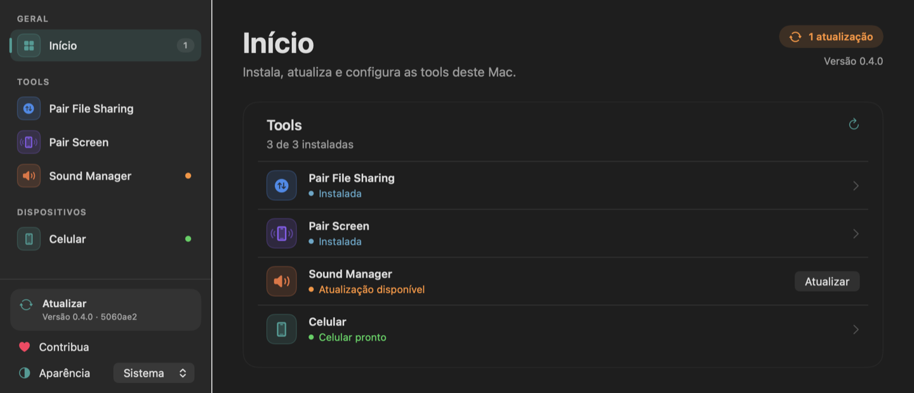
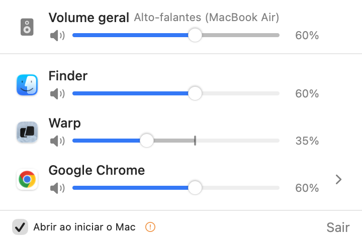

# Cunha Tools

Suíte de utilitários para macOS. O app **Cunha Tools** instala, atualiza, remove e configura cada utilitário (tool). As tools vêm embutidas nele.

| Tool | O que faz |
|---|---|
| **Sound Manager** | Volume de cada app, de cada aba do Chrome e do Mac inteiro, pela barra de menus |
| **Pair File Sharing** | Arquivos entre o Mac e o celular Android pela rede Wi-Fi, nos dois sentidos |
| **Pair Screen** | Tela do celular Android numa janela flutuante no Mac, com controle por mouse e teclado |

Pair File Sharing e Pair Screen usam o app Android companheiro, em `android/`. O Cunha Tools pareia o celular por adb e instala o app nele.



## Gerenciador

- A barra lateral lista a página Início, uma página por tool e a página Celular.
- A página Início lista as tools e o Celular com o estado de cada um. O botão da linha abre a página correspondente.
- A página de cada tool tem instalar, atualizar, abrir e remover, as permissões, o celular e a abertura no login. **Como usar**, fechado no fim da página, lista os passos de uso.
- A página do Sound Manager também muda o volume geral e o de cada app, e mostra ou esconde o ícone na barra de menus.
- O rodapé da barra lateral tem **Atualizar**, **Contribua** (QR Pix e código copia e cola) e **Aparência** (Sistema, Claro ou Escuro).

## Sound Manager

O ícone de onda sonora verde fica na barra de menus. O clique abre o volume geral do Mac e a lista dos apps que estão tocando som. A página Sound Manager do Cunha Tools mostra os mesmos controles, menos o volume por aba.



| Controle | O que faz |
|---|---|
| Volume geral | Volume e mudo do dispositivo de saída padrão. Acompanha as teclas de volume do Mac e a troca de dispositivo |
| Volume por app | Slider e mudo para cada app que toca som. O app guarda o valor de cada app entre aberturas |
| Volume por aba | No Chrome e em navegadores Chromium, slider e mudo para cada aba. Exige a extensão incluída no app |
| Abrir ao iniciar o Mac | Liga ou desliga a abertura automática no login |
| Mostrar na barra de menus | Na página do Sound Manager, no Cunha Tools. Oculto, o Sound Manager continua aberto. Abrir o app de novo, com ele já aberto, mostra o ícone |

### O volume geral é o teto

O volume efetivo de um app é o menor valor entre o volume do app e o volume geral.

- Mexer num app nunca altera o volume geral.
- Um app arrastado acima do volume geral para no volume geral.
- Um clique perto da ponta da trilha leva a 0% ou a 100%.
- Baixar o volume geral limita os apps que estão acima dele. O valor salvo de cada app se mantém. Quando o volume geral sobe de novo, cada app volta ao valor salvo.
- No slider do app, a trilha acima do teto fica esmaecida, e um marcador mostra o teto. O percentual mostra o volume efetivo.
- O volume por aba é relativo ao volume do app.

### Como funciona

- O Sound Manager usa os *process taps* do Core Audio (macOS 15). Para cada app abaixo de 100%, o Sound Manager cria um tap que silencia o som original do app, aplica o ganho e toca o resultado no dispositivo de saída, por um dispositivo agregado.
- Um app com volume próprio mantém o tap mesmo quando fica no teto. Assim, subir o volume geral só troca o ganho, sem esperar um tap novo.
- Um app que volta a 100% perde o tap 2 s depois. O áudio dele volta ao caminho normal do macOS.
- No dispositivo com volume próprio (ex.: alto-falantes do Mac), o ganho segue a curva de dB do próprio dispositivo. Um app em 30% soa igual ao dispositivo em 30%.
- No dispositivo sem volume próprio (HDMI, alguns DACs), o volume geral funciona por software. A legenda do volume geral mostra "por software".
- A extensão do navegador ajusta o volume dentro da página e conversa com o app por WebSocket em `ws://127.0.0.1:47821`.

As regras completas do teto e dos dois tipos de dispositivo estão em [`tools/sound-manager/README.md`](tools/sound-manager/README.md).

### Privacidade

- O áudio é processado no Mac. O Sound Manager não grava áudio em disco e não abre conexão de rede externa.
- A única porta aberta é `127.0.0.1:47821`, só na interface local. O app aceita só conexões com origem de extensão de navegador.
- A permissão "Gravação de áudio do sistema" existe porque o tap precisa ler o áudio de cada app para aplicar o volume.

## Pair File Sharing

App de barra de menus. Transfere arquivos entre o Mac e o celular pela rede Wi-Fi atual, com 4 conexões TCP em paralelo e criptografia AES-256-GCM.

| Sentido | Como |
|---|---|
| Mac → celular | Arraste arquivos ou pastas para o ícone da barra de menus. Também: "Escolher arquivos…" e Finder → Serviços → "Enviar para o celular" |
| Celular → Mac | Compartilhar → "Enviar para o Mac" |

O Mac grava em `~/Downloads/Pair File Sharing`. O celular grava em `Download/Pair File Sharing`. Detalhes em [`tools/pair-file-sharing/README.md`](tools/pair-file-sharing/README.md) e o protocolo em [`PROTOCOL.md`](tools/pair-file-sharing/PROTOCOL.md).

## Pair Screen

App de barra de menus. Espelha a tela do celular numa janela flutuante, por Wi-Fi (depuração sem fio) ou USB. No celular roda o `scrcpy-server` v4.1 (Apache-2.0). O cliente no Mac é Swift nativo, com decodificação H.265/H.264 em hardware.

Clique e arraste toca e desliza. Botão direito volta. Botão do meio vai para o início. ⌘V cola o clipboard do Mac no celular. A lista de controles está em [`tools/pair-screen/README.md`](tools/pair-screen/README.md).

## Instalação

Requisito: macOS 15 ou superior.

1. Baixe o [`CunhaTools.dmg`](https://github.com/mcunha12/cunha-tools/releases/latest/download/CunhaTools.dmg) da última versão.
2. Abra o DMG e arraste o **Cunha Tools** para **Aplicativos**.
3. Abra o Cunha Tools na pasta Aplicativos. O macOS bloqueia a primeira abertura, porque o app não é notarizado pela Apple.
4. Em Ajustes do Sistema → Privacidade e Segurança, clique em **Abrir Mesmo Assim** e confirme com a senha do Mac. Alternativa no Terminal:

   ```sh
   xattr -dr com.apple.quarantine "/Applications/Cunha Tools.app"
   ```

5. Na página Início do Cunha Tools, clique em **Instalar** na linha da tool e depois em **Instalar** na página dela. A tool vai para `/Applications` e abre.

Para compilar a partir do código, veja [Build](#build).

### Primeira abertura

1. O macOS pede a permissão "Gravação de áudio do sistema". Clique em **Permitir**. Sem ela, o volume por app não funciona. O volume geral de um dispositivo com volume próprio funciona sem ela.
2. Aberto a partir de `/Applications` ou `~/Applications`, o Sound Manager se registra para abrir no login. O checkbox "Abrir ao iniciar o Mac", no rodapé do menu, desliga o registro.

### Celular Android

1. No celular Samsung, desligue Configurações → Segurança e privacidade → **Bloqueador automático**.
2. Ative as Opções do desenvolvedor e ligue **Depuração sem fio**.
3. Na página Celular do Cunha Tools, instale as ferramentas Android (download de 16 MB do Google), clique em **Mostrar QR de pareamento** e leia o QR em Depuração sem fio → "Parear o dispositivo com um código QR".
4. Clique em **Instalar no celular** para instalar o app companheiro.

O Mac e o celular precisam estar na mesma rede Wi-Fi. Os passos completos estão em [`suite/README.md`](suite/README.md#celular).

### Volume por aba no Chrome

1. No menu do Sound Manager, clique na seta ao lado do Google Chrome.
2. Clique em **Instalar extensão**. O Finder abre a pasta da extensão, o caminho vai para a área de transferência e o Chrome abre `chrome://extensions`.
3. Ative o **Modo do desenvolvedor**, no canto superior direito.
4. Clique em **Carregar sem compactação** e escolha a pasta. Na janela de escolha, `Cmd+Shift+G` e `Cmd+V` colam o caminho.
5. Recarregue as abas que já estavam abertas.

### Atualizar

Clique em **Atualizar**, no rodapé da barra lateral. O botão lê a última versão publicada em [Releases](https://github.com/mcunha12/cunha-tools/releases). Se ela for maior que a versão aberta, o Cunha Tools:

1. Baixa o `CunhaTools.dmg` dessa versão.
2. Confere o app dentro do DMG: mesmo identificador, versão igual à da release e assinatura válida.
3. Instala o app na pasta de instalação (`/Applications`, ou `~/Applications` sem permissão de escrita).
4. Atualiza as tools instaladas cuja versão ficou para trás e reabre as que estavam abertas.
5. Manda para o Lixo as outras cópias do Cunha Tools: as de `/Applications` e `~/Applications` com outro nome e a cópia que estava aberta, se ela estava fora dessas pastas. Uma cópia num DMG fica onde está.
6. Apaga o download e reabre.

- Com a versão publicada igual ou menor que a aberta, o botão mostra **Atualizado** e não baixa nada.
- Uma falha no download ou na conferência do DMG não mexe na cópia instalada. O botão mostra o motivo.
- O Cunha Tools tira a quarentena da cópia instalada. A versão nova abre sem o **Abrir Mesmo Assim**.
- Uma tool só é trocada quando o `CFBundleVersion` dela sobe. Suba a versão a cada mudança numa tool.
- Instalar ou atualizar uma tool manda para o Lixo as outras cópias dela em `/Applications` e `~/Applications`.

## Limites

- Controle por aba: só Chrome e navegadores Chromium (Brave, Edge, Arc, Vivaldi, Opera). O Safari exige uma Safari Web Extension, e o build dela exige o Xcode. O Firefox não tem suporte.
- Páginas `chrome://` e a Chrome Web Store bloqueiam extensões. Nelas, só o mudo funciona.
- O volume por aba vale para abas carregadas depois da instalação da extensão, ou recarregadas.
- Com um app abaixo de 100%, o áudio dele passa pelo dispositivo agregado e ganha latência. O valor não foi medido.
- Os apps não são notarizados.
- Pair File Sharing: pastas enviadas pelo celular não entram, e uma transferência interrompida recomeça do zero.
- Pair Screen: sem áudio do celular.

## Estrutura

| Pasta | Conteúdo |
|---|---|
| `Package.swift` | Pacote Swift único. Cada pasta da lista `apps` vira um executável |
| `suite/` | Gerenciador Cunha Tools |
| `tools/sound-manager/` | Sound Manager: código, `Info.plist`, ícone e extensão do navegador |
| `tools/pair-file-sharing/` | Pair File Sharing: código, protocolo e teste de interoperabilidade com o Android |
| `tools/pair-screen/` | Pair Screen: cliente scrcpy nativo. O `build-hook.sh` baixa o `scrcpy-server` e confere o SHA-256 |
| `android/` | App companheiro Android, Java sem Gradle |
| `shared/CunhaKit/` | Código comum: item de início, comandos gerenciador → tool, estado da tool, canal gerenciador ↔ Sound Manager, slider com teto, cliente adb |
| `scripts/` | Build, instalação, assinatura, ícone, DMG e release |
| `dist/` | Guia de instalação que vai no DMG e o APK pronto do app companheiro |
| `docs/` | Imagens deste README |

## Build

Requisitos:

- Command Line Tools da Apple: `xcode-select --install`. O Xcode não é necessário.
- Para o app Android: Android SDK em `~/Library/Android/sdk` (`platforms;android-35`, `build-tools;35.0.0`) e JDK 17 (`brew install openjdk@17`). Sem eles, a suíte compila sem o app companheiro. O APK pronto também fica em `dist/android/cunha-companion.apk`.

```sh
git clone https://github.com/mcunha12/cunha-tools.git
cd cunha-tools
./scripts/build-suite.sh
open "build/Cunha Tools.app"
```

O primeiro build cria a identidade de assinatura local "Cunha Tools Local Signing" num keychain próprio, `~/Library/Keychains/cunhatools-signing.keychain-db`, e o adiciona à lista de keychains do usuário. Com a mesma identidade, o macOS mantém as permissões entre builds.

| Comando | Resultado |
|---|---|
| `./scripts/build.sh tools/sound-manager` | `build/Sound Manager.app`, universal (arm64 e x86_64) |
| `./scripts/install.sh tools/sound-manager` | Build, troca a cópia em `/Applications` e abre |
| `./scripts/build-suite.sh` | `build/Cunha Tools.app` com as tools e o APK embutidos |
| `android/build.sh` | `build/android/cunha-companion.apk` e a cópia em `dist/android/` |
| `./scripts/make-dmg.sh` | `build/CunhaTools-<versão>.dmg`, com o atalho para Aplicativos e o guia [`dist/Como instalar.txt`](dist/Como%20instalar.txt) |
| `./scripts/release.sh` | Build universal, `build/CunhaTools.dmg` e a release `v<versão>` no GitHub com esse DMG |
| `swift scripts/make-icon.swift <símbolo> <#topo> <#base> <saída.icns>` | Ícone a partir de um SF Symbol sobre gradiente |

| Variável | Efeito |
|---|---|
| `ARCHS=arm64` | Pula o build universal |
| `SCRATCH=<pasta>` | Pasta de build do SwiftPM separada, para builds em paralelo |
| `CUNHA_ONLY=tools/sound-manager,suite` | Limita o pacote às pastas listadas |
| `SKIP_ANDROID=1` | Compila a suíte sem o app companheiro |
| `DRY_RUN=1` | O `release.sh` gera o DMG e mostra as chamadas à API do GitHub sem enviar nada |

### Publicar uma versão

1. Suba `CFBundleShortVersionString` e `CFBundleVersion` em `suite/Resources/Info.plist`. A tag da release é `v` + `CFBundleShortVersionString`.
2. Faça o merge no `main` e atualize o clone. O `release.sh` exige a árvore sem mudanças e o `HEAD` igual ao `origin/main`.
3. Rode `./scripts/release.sh`.

- O script recusa uma tag que já existe no GitHub e uma suíte sem alguma tool, sem o APK ou sem as duas arquiteturas.
- O script cria a release como rascunho, envia o `CunhaTools.dmg` e só então publica. Se o envio falhar, o script apaga o rascunho, e a versão publicada antes continua sendo a última.
- O token vem do `git credential fill`, a mesma credencial do `git push`.
- O asset tem sempre o nome `CunhaTools.dmg`. O link `releases/latest/download/CunhaTools.dmg` aponta para a versão mais nova.
- Rode o `release.sh` no Mac que tem a identidade "Cunha Tools Local Signing". Com outra identidade, cada Mac pede de novo as permissões das tools.

## Adicionar uma tool

1. Crie `tools/<id>/Sources`, `tools/<id>/Resources/Info.plist` e `tools/<id>/Resources/AppIcon.icns` (`CFBundleIconFile` = `AppIcon`).
2. Registre o executável na lista `apps` do `Package.swift`.
3. No `Info.plist`, preencha as chaves que o Cunha Tools lê:

| Chave | Tipo | Uso |
|---|---|---|
| `CunhaToolSummary` | string | Subtítulo da página da tool |
| `CunhaToolRequirements` | array | O que a tool precisa: `audioCapture`, `localNetwork`, `phone` |
| `CunhaToolSymbol` | string | SF Symbol do ícone na barra lateral e no Início |
| `CunhaToolTint` | string | Cor do ícone, em `#RRGGBB` |
| `CunhaToolGuide` | array | Passos de **Como usar**, no máximo 3, um texto por passo |

4. Suba `CFBundleShortVersionString` e `CFBundleVersion` a cada mudança no código. O Atualizar só troca uma tool instalada com versão menor.
5. Na abertura, crie um `LaunchAtLogin`, chame `applyDefault()` nele e passe-o para `ToolControl.listen(launchAtLogin:openSetup:)`. Publique o estado de setup com `ToolStatus.publish(setupComplete:)`.
6. Um script executável em `tools/<id>/build-hook.sh` roda antes da assinatura, com o caminho do `.app`. É opcional.

## Testes

O Command Line Tools não executa XCTest nem swift-testing. Cada app traz autotestes no próprio binário, chamados por flag.

| Comando | O que verifica |
|---|---|
| `CUNHA_INSTALL_DIR=<pasta> "build/Cunha Tools.app/Contents/MacOS/CunhaTools" --selftest-install` | Catálogo, instalação, atualização e remoção numa pasta de teste |
| `CUNHA_INSTALL_DIR=<pasta> CUNHA_UPDATE_DMG=<dmg> "build/Cunha Tools.app/Contents/MacOS/CunhaTools" --selftest-update` | Atualizar: consulta da release no GitHub real, depois download, conferência e troca da suíte numa pasta de teste com um DMG local, e recusa de seis DMGs quebrados |
| `"build/Cunha Tools.app/Contents/MacOS/CunhaTools" --selftest-phone` | QR de pareamento e leitura das respostas do adb |
| `"build/Cunha Tools.app/Contents/MacOS/CunhaTools" --selftest-remote` | Canal com o Sound Manager aberto: volume geral, mudo, volume por app, ícone na barra de menus, mensagens inválidas, fechar e abrir. Altera o volume real do Mac e restaura no fim |
| `"build/Cunha Tools.app/Contents/MacOS/CunhaTools" --render-ui <saída.png> [--page inicio\|celular\|<tool>] [--guide] [--contribute] [--dark]` | Barra lateral e página renderizadas em PNG |
| `"build/Sound Manager.app/Contents/MacOS/SoundManager" --selftest-ceiling` | Regras do teto e do ganho |
| `"build/Sound Manager.app/Contents/MacOS/SoundManager" --selftest-slider` | Cliques e arraste no slider |
| `open -n -W "build/Sound Manager.app" --stdout /tmp/rt.log --args --selftest-router` | Tempo de vida do tap num processo real |
| `"build/Sound Manager.app/Contents/MacOS/SoundManager" --selftest-master` | Leitura e escrita do volume geral. Altera o volume real do Mac e restaura no fim |

Os testes de cada tool estão no README dela: [Sound Manager](tools/sound-manager/README.md#verificação), [Pair File Sharing](tools/pair-file-sharing/README.md#verificação) e [Pair Screen](tools/pair-screen/README.md#verificação). O [`suite/README.md`](suite/README.md#verificação) lista os do gerenciador.
